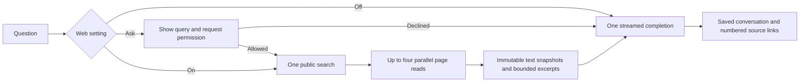

# Chat and web architecture

## Request path

`web_chat.py` controls the entire sequence. The model receives ordinary messages and numbered page excerpts; it does not receive callable tools or an action schema. There are no planning, relevance-review, claim-review, repair, delegation, or escalation model calls.

Public search uses DDGS metasearch, SearXNG, or Brave, independently of the completion provider. The query comes only from the user's question and, for short follow-ups, the previous user-authored topic. Project notes, private files, and assistant answers do not enter the query. Web Ask shows the full query before sending it.

Up to four distinct result URLs are read concurrently. A page failure is recorded and excluded; if no page is readable, the workflow abstains without asking the model to invent a sourced answer. There is no automatic provider retry loop.

## Source storage

Canonical extracted text is immutable and content-addressed. HTML extraction preserves paragraph and table boundaries. Page excerpts have source-version IDs and exact character ranges; the source viewer highlights exactly what was supplied to the model. Invalid citation numbers are removed and grouped citations are normalized without another completion. A missing inline citation is disclosed.

New snapshots and uploaded files use lexical publication without external embeddings. Existing vector generations and source versions remain readable. SQLite stores empty vectors for new lexical-only chunks; PostgreSQL retains its existing schema and isolates lexical-only publication in its own generation using placeholder vectors. New chat never performs vector retrieval.

## Completion providers

Ollama uses `/api/chat`, NDJSON streaming, and `options.num_ctx=16384`. Other local servers use ordinary Chat Completions and SSE. OpenAI uses Responses output-text events with `store=false`. No provider receives a tools list. Streams that end prematurely or report failure are treated as incomplete.

Requests and approval states use `run_store.py`; the table is a normal chat progress record. Closing the browser does not cancel an in-flight request. A server restart marks unfinished requests interrupted. Provider selections, project settings, and conversation databases keep their existing paths.

## UI

`index.html`, `chat.css`, and `app.js` implement one chat interface, Sources, Models, and Settings. Desktop has a navigation sidebar; mobile uses a dismissible drawer. The conversation scroll area and composer occupy separate flex rows. Wide tables scroll within their message. Theme and font tokens remain in `tokens.css`; bundled fonts are served locally.

## Deliberate bounds

DDGS consults at most DuckDuckGo and Brave for one host query, with a 12-second request timeout; SDK scheduling and multiple HTTP exchanges can exceed that wall time. SearXNG and Brave API requests also have a 12-second socket timeout. Page socket timeout: 6 seconds, at most three redirect attempts. At most four pages, sharing a 24,000-character context budget with at most 12,000 characters from one page. History is bounded. Completion has its configured timeout and a 4,096-token output limit. This is not exhaustive research and does not promise semantic verification of every generated claim.
